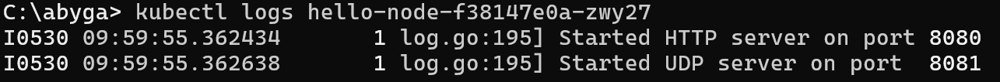
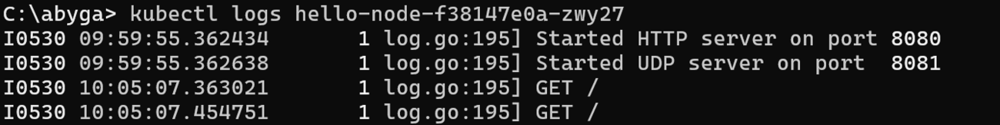

# Tutorial 11 - Deployment on Kubernetes
**Emanuella Abygail - 2306152185 - Kelas A**

## Hello Minikube

> Compare the application logs before and after you exposed it as a Service.

Before:

After:

Terdapat perbedaan jumlah log antara sebelum dan sesudah aplikasi diekspos sebagai sebuah Service. Sebelum diekspos, aplikasi hanya diakses langsung melalui pod, sehingga log hanya mencatat pesan inisialisasi seperti Started HTTP server on port 8080 dan Started UDP server on port 8081.

Setelah aplikasi diekspos sebagai Service menggunakan perintah minikube service hello-node, log tetap mencatat pesan inisialisasi, tetapi juga mulai merekam permintaan masuk melalui Service. Setiap kali aplikasi dibuka atau di-refresh di browser saat proxy ke Service aktif, jumlah entri log bertambah karena adanya request GET dari browser. Hal ini terlihat dari peningkatan entri log pada waktu tertentu, misalnya dari 09:59:55 ke 10:05:07.

> Notice that there are two versions of `kubectl get` invocation during this tutorial section. The first does not have any option, while the latter has `-n` option with value set to

Opsi -n pada perintah kubectl get digunakan untuk menentukan namespace tertentu dalam Kubernetes. Fungsinya adalah untuk memfilter resource berdasarkan namespace, yang berguna saat ada beberapa resource dengan nama serupa di berbagai namespace. Jika perintah kubectl get dijalankan tanpa -n, maka hanya akan menampilkan resource dari namespace default. Namespace sendiri berperan sebagai cara untuk mengelompokkan dan memisahkan resource dalam satu cluster. Ketika -n kube-system digunakan, perintah tersebut akan menampilkan resource yang berada di namespace kube-system, yaitu namespace yang digunakan untuk komponen internal Kubernetes seperti DNS dan API server. Oleh karena itu, resource yang dibuat pengguna tidak muncul saat melihat namespace kube-system, karena secara default resource pengguna berada di namespace default.
