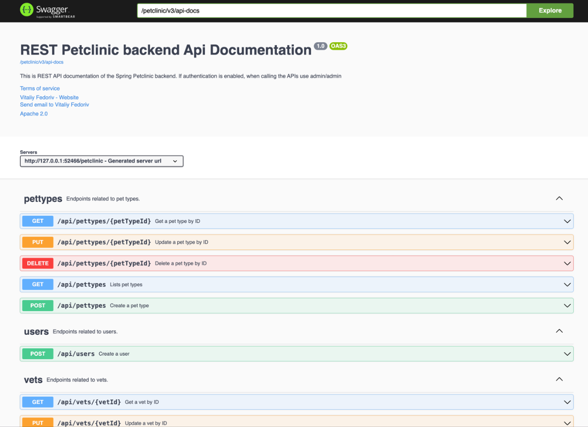

# Tutorial 11 - Deployment on Kubernetes
**Emanuella Abygail - 2306152185 - Kelas A**

## Hello Minikube

> Compare the application logs before and after you exposed it as a Service.

Before:

After:

Terdapat perbedaan jumlah log antara sebelum dan sesudah aplikasi diekspos sebagai sebuah Service. Sebelum diekspos, aplikasi hanya diakses langsung melalui pod, sehingga log hanya mencatat pesan inisialisasi seperti Started HTTP server on port 8080 dan Started UDP server on port 8081.

Setelah aplikasi diekspos sebagai Service menggunakan perintah minikube service hello-node, log tetap mencatat pesan inisialisasi, tetapi juga mulai merekam permintaan masuk melalui Service. Setiap kali aplikasi dibuka atau di-refresh di browser saat proxy ke Service aktif, jumlah entri log bertambah karena adanya request GET dari browser. Hal ini terlihat dari peningkatan entri log pada waktu tertentu, misalnya dari 09:59:55 ke 10:05:07.

> Notice that there are two versions of `kubectl get` invocation during this tutorial section. The first does not have any option, while the latter has `-n` option with value set to

Opsi -n pada perintah kubectl get digunakan untuk menentukan namespace tertentu dalam Kubernetes. Fungsinya adalah untuk memfilter resource berdasarkan namespace, yang berguna saat ada beberapa resource dengan nama serupa di berbagai namespace. Jika perintah kubectl get dijalankan tanpa -n, maka hanya akan menampilkan resource dari namespace default. Namespace sendiri berperan sebagai cara untuk mengelompokkan dan memisahkan resource dalam satu cluster. Ketika -n kube-system digunakan, perintah tersebut akan menampilkan resource yang berada di namespace kube-system, yaitu namespace yang digunakan untuk komponen internal Kubernetes seperti DNS dan API server. Oleh karena itu, resource yang dibuat pengguna tidak muncul saat melihat namespace kube-system, karena secara default resource pengguna berada di namespace default.

## Rolling Update & Kubernetes Manifest File

> What is the difference between Rolling Update and Recreate deployment strategy? Hint: Read the Deployments documentation.

Perbedaan utama antara strategi Rolling Update dan Recreate terletak pada cara keduanya melakukan pembaruan terhadap pod, serta dampaknya terhadap ketersediaan aplikasi. Strategi Recreate akan menghentikan seluruh pod dari versi lama terlebih dahulu, kemudian baru membuat pod baru. Hal ini menyebabkan adanya waktu henti (downtime) selama proses update berlangsung. Strategi ini cocok digunakan jika versi lama dan versi baru tidak dapat berjalan secara bersamaan karena adanya konflik sumber daya atau dependency. Sebaliknya, Rolling Update memperbarui aplikasi secara bertahap. Pod baru akan dibuat satu per satu, sementara sebagian pod lama tetap berjalan hingga pembaruan selesai. Dengan pendekatan ini, aplikasi tetap tersedia selama proses berlangsung, menjadikannya lebih ideal untuk aplikasi yang membutuhkan high availability.

**Endpoint Pet Clinic**

> Try deploying the Spring Petclinic REST using Recreate deployment strategy and document your attempt.

Untuk menerapkan strategi Recreate pada aplikasi Spring Petclinic REST, saya terlebih dahulu menyesuaikan file manifest deployment yang sebelumnya menggunakan strategi Rolling Update. Saya menambahkan bagian strategy dengan tipe Recreate pada bagian spec di file deployment_recreate.yaml. Setelah itu, saya menjalankan perintah kubectl apply -f deployment_recreate.yaml untuk menerapkan perubahan tersebut dan melihat proses deployment berlangsung sesuai dengan strategi Recreate.

> Prepare different manifest files for executing Recreate deployment strategy.

Saya menyiapkan file manifest bernama deployment_recreate.yaml yang dikonfigurasi khusus untuk menggunakan strategi Recreate. File ini dibuat berdasarkan deployment.yaml sebelumnya, dengan melakukan perubahan pada bagian strategi deployment. Pada bagian spec.strategy.type, saya mengganti nilainya dari RollingUpdate menjadi Recreate. File ini kemudian digunakan untuk deployment yang tidak mengizinkan pod lama dan pod baru berjalan bersamaan.

> What do you think are the benefits of using Kubernetes manifest files? Recall your experience in deploying the app manually and compare it to your experience when deploying the same app by applying the manifest files (i.e., invoking kubectl apply -f command) to the cluster.

Menurut saya, penggunaan file manifest di Kubernetes memberikan banyak manfaat, terutama dalam hal konsistensi, efisiensi, dan kemudahan otomasi. Tanpa manifest, proses deployment harus dilakukan secara manual dengan menjalankan banyak perintah kubectl, yang rawan kesalahan dan memakan waktu. Dengan manifest, konfigurasi hanya perlu dituliskan satu kali, dapat digunakan ulang, dan dijalankan secara otomatis dengan perintah kubectl apply -f. Selain itu, manifest juga berfungsi sebagai dokumentasi yang jelas dan dapat versi-kan, sehingga memudahkan pengelolaan konfigurasi aplikasi ke depannya.